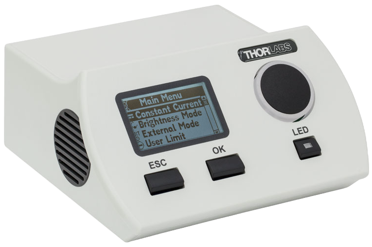

Overview
========================================================================================

**Quadled Controller**

**Version**: 1.0.0

**Project Goals**:

- The solution in the scope is a tabletop LED Controller, which is used in lab environments
  and controls the LED panels of various wavelengths connected to it over a serial interface.
  The device's core functionality is light emission control and dozing.

- The Client plans to introduce a new 4-channel Controller device to the current product
  line following the demand for new functionality from their Clients. This device will be
  an upgrade to the current single-channel LED controller by allowing the user to use 4 end
  devices (LED panels) simultaneously and control them via an improved user interface.
  In addition, this device will allow users to easily select their desired outputs and
  control the system from a display screen with analog buttons.

- The scope of the project is divided into two streams:

  - **LED Controller**
  
  - **Desktop application**

- No source code or design files of the exisitng solution are available, therefore the
  solution has to be developed from scratch.

- The Client is seeking a highly qualified and reliable partner committed to delivering the project with deep experience in the following solution areas:
  
  - **Hardware design**
  
  - **Firmware development**
  
  - **Desktop software development**

**Release notes**: 

- **1.0.0**: The initial release version of the project, to be tracked and maintained
  through a version control system to ensure smooth iterative improvements and bug fixes.

.. raw:: latex
  
   \newpage

New Tabletop LED Controller Concept
----------------------------------------------------------------------------------------

The LED Controller is envisioned as a device that will drive up to four LED panels
simultaneously and provide control over the process by adjusting the waveform, frequency,
output power, and operating time. The solution will have a dedicated control panel (Display + buttons)
with controls for each of the four channels, allowing the operator to adjust operating and
display settings. The Device will also support headless operation so that the device can be
controlled from other devices by communication over the protocol already used by other devices
in the Client's lineup.

**Note**: In the scope of this stream, the Contactor shall focus on hardware development
(Schematic and PCB design), while the Client will be responsible for industrial and
mechanical design activities.

State-of-the-Art Analysis
----------------------------------------------------------------------------------------

Current Solutions
~~~~~~~~~~~~~~~~~~~~~~~~~~~~~~~~~~~~~~~~~~~~~~~~~~~~~~~~~~~~~~~~~~~~~~~~~~~~~~~~~~~~~~~~

The LED control domain in laboratory and industrial settings is currently served by
several commercial systems, typically focusing on single- or dual-channel solutions with
limited flexibility.

- **Market Leaders**:

  Market leaders such as Thorlabs, CoolLED, and Mightex offer devices that support
  wavelength control, power modulation, and basic scripting interfaces.

  - **Thorlabs DC4100**: a four-channel LED driver with USB control and TTL inputs. Strong integration with microscopy platforms but limited in waveform flexibility.
  - **CoolLED pE-300 Series**: targets fluorescence microscopy; offers modular wavelengths but lacks user-configurable timing and waveform shaping.
  - **Mightex BLS-SA04-US**: offers real-time control over 4 LED channels, but with a less intuitive user interface and basic software support.

- **Competitor Analysis**:

  +----------------------+------------------+------------------+-------------------------+
  | Feature              | Thorlabs DC4100  | Mightex BLS-SA04 | Proposed QuadLED        |
  +----------------------+------------------+------------------+-------------------------+
  | Channels             | 4                | 4                | 4                       |
  +----------------------+------------------+------------------+-------------------------+
  | Waveform Support     | Limited (TTL)    | Sine, square     | Full (custom Hz, duty)  |
  +----------------------+------------------+------------------+-------------------------+
  | Display Interface    | None             | Basic LCD        | Full GUI + encoder      |
  +----------------------+------------------+------------------+-------------------------+
  | Remote Control       | USB only         | USB, TTL         | USB, UART (custom FW)   |
  +----------------------+------------------+------------------+-------------------------+
  | Software GUI         | Basic            | Limited          | Desktop + Protocol GUI  |
  +----------------------+------------------+------------------+-------------------------+
  | Price Range (USD)    | ~$2,000          | ~$1,800          | TBD (cost-effective)    |
  +----------------------+------------------+------------------+-------------------------+

- **Adoption Rates**:

  These systems are widely used in research labs, yet primarily target niche use cases such as
  microscopy or optogenetics. Broader adoption is limited by pricing, customization inflexibility,
  and lack of integration into production workflows.

- **Limitations**:

  - Lack of user-configurable power stages or “on-the-fly” tuning.
  - Weak GUI support or overly complex control protocols.
  - Limited waveform types and timing control.
  - No support for production EEPROM configuration in many commercial devices.

Technological Trends
~~~~~~~~~~~~~~~~~~~~~~~~~~~~~~~~~~~~~~~~~~~~~~~~~~~~~~~~~~~~~~~~~~~~~~~~~~~~~~~~~~~~~~~~

Recent shifts in embedded and lab automation hardware are unlocking more user-centric,
flexible, and interoperable devices. These trends are directly relevant to the QuadLED controller's
roadmap.

- **Innovative Practices**:

  - Adoption of **Arduino-compatible ecosystems** (e.g., Teensy, STM32duino, or Raspberry Pi Pico)
    to reduce development overhead and leverage robust community libraries, tooling, and rapid
    prototyping support.

  +-------------------+-----------------------------------------+-----------------------------------------+
  | Platform          | Strengths                               | Limitations                             |
  +-------------------+-----------------------------------------+-----------------------------------------+
  | Arduino           | Educational projects, prototyping       | Toolchain not suitable for              |
  |                   | vast libraries                          | robust production workflows             |
  +-------------------+-----------------------------------------+-----------------------------------------+
  | Teensy (PJRC)     | Powerful ARM cores, real-time           | A niche but trusted choice              |
  |                   | audio, USB native support               | in precise control                      |
  +-------------------+-----------------------------------------+-----------------------------------------+
  | STM32duino        | Powerful MCU family, full compatibility |                                         |
  |                   | with widely available ST boards         |                                         |
  +-------------------+-----------------------------------------+-----------------------------------------+
  | ESP32 (Espressif) | Dominates the Wi-Fi-connected           | Some ESP32 modules are                  |
  |                   | microcontroller market                  | not pre-certified                       |
  +-------------------+-----------------------------------------+-----------------------------------------+
  | Raspberry Pi Pico | Educational projects, simple            | SDK is powerful but less mature than    |
  |                   | automation, low cost                    | STM32 ecosystem (CubeMX, STM32CubeIDE)  |
  +-------------------+-----------------------------------------+-----------------------------------------+

  - Adoption of **cross-platform desktop frameworks** (e.g., Electron or .NET MAUI) enabling maintainable GUIs.

- **Ecosystem Changes**:

  - Growth in **USB-to-UART bridges** and **protocol standardization** for lab device communication.
  - Movement toward **modular firmware** to support diverse device types over the same core.
  - Increased use of **headless and script-driven operation** for automation in industrial and research settings.

- **Market Dynamics**:

  - Rising demand for **customizable, multi-channel control systems** in photobiology, diagnostics, and material testing.
  - Emphasis on **data traceability**, **calibration standards**, and **firmware update mechanisms**.
  - Increasing user expectation for **modern GUI tools**, even for low-volume hardware.

- **Opportunities**:

  - Deliver a cost-effective solution with advanced modulation, better UI, and production-friendly tools.
  - Provide seamless configuration through a single interface for field and factory use.
  - Offer continuous, user-driven feature updates thanks to open firmware and updatable interfaces.

Gaps in Current Solutions
~~~~~~~~~~~~~~~~~~~~~~~~~~~~~~~~~~~~~~~~~~~~~~~~~~~~~~~~~~~~~~~~~~~~~~~~~~~~~~~~~~~~~~~~

Despite existing LED controllers on the market, users often struggle with device
configuration complexity, lack of workflow integration, and inflexible hardware behavior.

- **Functional Deficits**:

  - No easy way to assign and recall current stages per channel dynamically.
  - Insufficient support for continuous operation at full power across all channels.
  - Lack of integrated timers and fine-grained waveform control.

- **User Pain Points**:

  - Setup processes often require multiple software tools or manual programming.
  - Calibration/config data must often be entered by hand, risking human error.
 

- **Inefficiencies**:

  - Many existing solutions are built with outdated firmware stacks and GUI frameworks.
  - Hardware designs may overheat or throttle under continuous load due to poor thermal design.
  - No unified tooling for factory and field usage—desktop apps often feel like afterthoughts.

- **Differentiators**:
  
  - A **single, unified solution** integrating GUI-based configuration, multi-channel firmware,
    and ergonomic hardware controls.
  - Dynamic stage tuning, audible feedback, full waveform control, and support for headless or
    manual operation.
  - Production-friendly design without specialized tools.
